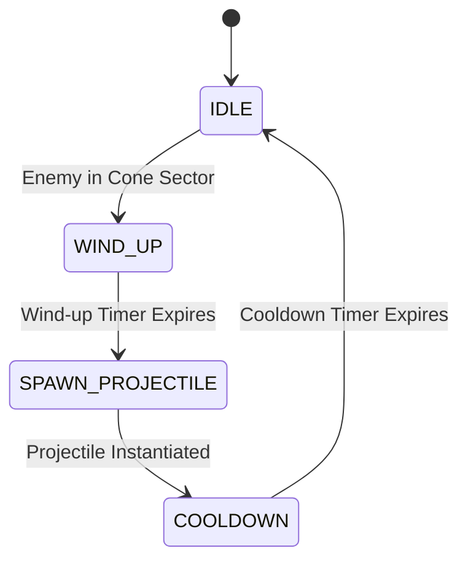

# 05 — Habit System, Directional Wedge Targeting & Projectile Mechanics

Habits are static defensive structures that scan their active cone sector, execute directional wedge targeting, and launch projectiles or area pulses. One `Habit.tscn` operates as a Focus Timer (rapid machine gun), Mindfulness pulse, or Exercise heavy launcher based on its underlying `HabitData` properties.

> Theme: Habits deal **Willpower** and/or **Awareness** damage and apply **Calm / Interrupt / Slow** status effects. They are constructed exclusively on **high ground** (`07`).

---

## 1. Cone Angle Target Filtering (Directional Wedge / SWHAOP)

Towers do NOT use default 360-degree detection unless explicitly configured for omnidirectional Support. Instead, targeting relies on a **Directional Sector Wedge**:

### Targeting Validation Criteria
An enemy target is considered **valid** if and only if:
1. **Distance Check**: `global_position.distance_to(enemy.global_position) <= attack_range`
2. **Cone Angle Vector Math**:
   ```gdscript
   var facing_vector := Vector2.RIGHT.rotated(facing_angle)
   var dir_to_enemy  := (enemy.global_position - global_position).normalized()
   var angle_diff    := absf(facing_vector.angle_to(dir_to_enemy))
   var is_in_cone    := angle_diff <= deg_to_rad(arc_angle / 2.0)
   ```

### Dynamic Arc Angle Clamping
- `arc_angle` is dynamically interpolated based on player reticle distance from tower during re-aiming:
  - **Close reticle (near 20px)**: Expands cone to wide scatter (`125.0°`).
  - **Distant reticle (near max_range)**: Tightens cone to sniper focus (`10.0°`).
- Strict Enforcement: `arc_angle = clampf(calculated_arc, 10.0, 125.0)`

```gdscript
func is_point_in_cone(target_pos: Vector2) -> bool:
	var dist := global_position.distance_to(target_pos)
	if dist > current_attack_range:
		return false
	var facing_vector := Vector2.RIGHT.rotated(facing_angle)
	var dir_to_target  := (target_pos - global_position).normalized()
	var angle_diff    := absf(facing_vector.angle_to(dir_to_target))
	return angle_diff <= deg_to_rad(arc_angle / 2.0)
```

---

## 2. Projectile Trajectory Mechanics (2.5D Visual Height)

Projectiles support two distinct trajectory modes to provide arcade-style visual feedback:

### A. Linear Homing (Fast Focus Shots / Energy Needles)
Moves directly toward the target node's live coordinates. Updates direction vector per frame.

### B. Parabolic Arc (Standard Arrows / Mortars / Artillery Bombs)
Simulates 2.5D height using a root node moving in 2D space combined with a local Y-offset applied to the child `Sprite2D`:

1. **Travel Progress**: `t = elapsed_time / total_flight_time`, clamped between `0.0` and `1.0`.
2. **Root Node**: Lerps linearly in 2D space from `start_pos` to `target_pos`:
   `global_position = start_pos.lerp(target_pos, t)`
3. **Sprite Child Visual Y-Offset**:
   `var y_offset: float = -4.0 * max_arc_height * t * (1.0 - t)`
   `sprite.position.y = y_offset`
4. **Tangent Rotation**: Rotate the sprite to match the flight vector (combining 2D ground velocity + visual height derivative `dy/dt`):
   ```gdscript
   var ground_vel   := (target_pos - start_pos) / total_flight_time
   var dy_offset_dt := -4.0 * max_arc_height * (1.0 - 2.0 * t) / total_flight_time
   var visual_vel   := ground_vel + Vector2(0, dy_offset_dt)
   sprite.rotation  := visual_vel.angle()
   ```

```gdscript
# GDScript Example: Parabolic Arc Trajectory Update
extends Node2D

@onready var sprite: Sprite2D = $Sprite2D

var start_pos: Vector2
var target_pos: Vector2
var flight_speed: float = 400.0
var max_arc_height: float = 64.0

var total_flight_time: float
var elapsed_time: float = 0.0

func setup_parabolic(from: Vector2, to: Vector2, height: float = 64.0) -> void:
	start_pos = from
	target_pos = to
	max_arc_height = height
	global_position = start_pos
	var dist := start_pos.distance_to(target_pos)
	total_flight_time = maxf(0.1, dist / flight_speed)

func _process(delta: float) -> void:
	elapsed_time += delta
	var t: float = clampf(elapsed_time / total_flight_time, 0.0, 1.0)
	
	# 2D Linear Ground Motion
	global_position = start_pos.lerp(target_pos, t)
	
	# 2.5D Visual Height Parabola
	var y_offset: float = -4.0 * max_arc_height * t * (1.0 - t)
	sprite.position.y = y_offset
	
	# Visual Tangent Rotation
	var ground_vel: Vector2 = (target_pos - start_pos) / total_flight_time
	var dy_dt: float = -4.0 * max_arc_height * (1.0 - 2.0 * t) / total_flight_time
	var visual_vel: Vector2 = Vector2(ground_vel.x, ground_vel.y + dy_dt)
	sprite.rotation = visual_vel.angle()
	
	if t >= 1.0:
		_on_impact()
```

---

## 3. Target Lead Math (Predictive Aim for Artillery)

For non-homing AoE mortar shots or heavy projectiles, towers predict the future position of moving enemies along their path:

### Predictive Flight Formula
1. **Estimated Flight Time**: `flight_time = distance_to_target / projectile_speed`
2. **Predicted Progress along Path**:
   `predicted_progress = enemy.progress + (enemy.speed * flight_time)`
3. **Sample Target Point**: Query curve or cell path at `predicted_progress` coordinate.

```gdscript
func get_predictive_target_pos(enemy: Distraction, projectile_speed: float) -> Vector2:
	var current_pos := enemy.global_position
	var dist := global_position.distance_to(current_pos)
	var est_time := dist / maxf(1.0, projectile_speed)
	
	if enemy.has_method("get_predicted_position"):
		return enemy.get_predicted_position(est_time)
	
	# Linear velocity fallback
	return current_pos + (enemy.velocity * est_time)
```

---

## 4. Attack Sequence Timing & State Machine

To enforce tactical visual feedback, towers cycle through a structured **Attack State Flow**:



### State Definitions
1. **`IDLE`**: Tower scans active cone sector (`is_point_in_cone`).
2. **`WIND_UP`**: Plays telegraph / animation (barrel recoil charging or glowing highlight).
3. **`SPAWN_PROJECTILE`**: Instantiates directional or parabolic projectile into global `ProjectileLayer`.
4. **`COOLDOWN`**: Enforces `fire_cooldown` timer before next wind-up cycle.

```gdscript
# GDScript Example: Tower Attack State Machine
enum TowerState { IDLE, WIND_UP, SPAWN_PROJECTILE, COOLDOWN }
var current_state: TowerState = TowerState.IDLE

var wind_up_time: float = 0.12
var wind_up_timer: float = 0.0

func _process_attack_state(delta: float) -> void:
	match current_state:
		TowerState.IDLE:
			if is_any_distraction_in_cone():
				current_state = TowerState.WIND_UP
				wind_up_timer = wind_up_time
		
		TowerState.WIND_UP:
			wind_up_timer -= delta
			if wind_up_timer <= 0.0:
				current_state = TowerState.SPAWN_PROJECTILE
		
		TowerState.SPAWN_PROJECTILE:
			_execute_spawn_projectile()
			current_state = TowerState.COOLDOWN
			cooldown = current_fire_cooldown
		
		TowerState.COOLDOWN:
			cooldown -= delta
			if cooldown <= 0.0:
				current_state = TowerState.IDLE
```

---

## Intersection with the prototype

**The real mechanic differs from the target design above in one important structural way — read
this before tuning anything.** `Habit` (`scripts/tower.gd`) never selects or locks onto a target,
and there's no combat-time "lead the enemy" logic. But the reticle-distance arc from §1 **is**
real — it's just a deliberate, player-driven **aim/re-aim step**, not a continuous per-frame
targeting computation:

- **Aiming is a distinct mode, separate from combat.** `game.gd::_update_aiming_process()` runs
  only while `is_aiming == true` — entered right after building a habit, or via the built habit's
  "Re-Aim Cone" button. While aiming: mouse angle from the habit sets `facing_angle` live, and
  mouse *distance* maps `20px .. attack_range → 125° .. 10°` (`lerpf(125.0, 10.0, norm_dist)`) —
  matching §1's numbers exactly. A left-click locks both values in and exits aiming mode; a
  right-click cancels. Outside that mode, `facing_angle`/`arc_angle` never change on their own.
  ✔ (mechanically identical to §1, just relocated from `tower.gd` to `game.gd`'s input handling,
  and explicitly player-gated rather than automatic.)
- **Once locked, the habit target-locks inside its cone.** (This paragraph used to describe a
  continuous barrel sweep; that code is gone.) Each frame the habit picks the **nearest live
  distraction inside the cone**, slews the barrel toward it at 8 rad/s, and may fire only when the
  barrel is within `AIM_TOLERANCE_DEG` (12°) of the target — the alignment gate exists because
  firing on cooldown alone dumped shots into empty space every time the nearest-target pick
  flipped. AoE habits ignore the barrel and pulse everyone in the cone, capped at
  `AOE_MAX_TARGETS` (6), nearest first. Non-AoE habits fire one **directional** projectile along
  the barrel `_aim`; it sweeps a segment each frame (no gaps between frames) and **pierces up to
  `Projectile.MAX_PIERCE` (4) bodies**. The two archetypes are deliberately bounded mirrors:
  cone = area, capped; projectile = line, capped.
- No `TargetingMode` (`FIRST`/`LAST`/`STRONGEST`/… from `02`'s `HabitData`) — targeting is always
  nearest-in-cone; nothing reads a mode.
- `projectile.gd` is directional-only — the old unreachable homing mode (`setup(target, …)`) has
  been deleted along with `Game.spawn_projectile()`. No parabolic arc height, no predictive lead,
  no `WIND_UP`/telegraph state.
- **Support habits never enter any of this.** A habit with no damage and no AoE
  (`HabitData.is_support()` — the Anchor line) skips aiming on build, never targets or fires, and
  draws as a pylon whose ring is its Routine radius.

### The Focus Timer work cycle (Pomodoro)

The `focus_timer` line — and **only** that line — runs in work intervals. It fires for
`work_duration`, then must rest before it fires again, and the barrel returns to its facing so a
resting habit reads as visibly idle rather than merely silent. Two rules keep the rest honest:
work drains only while actually firing at a target, and **the break drains only on wave time too**
— it used to run on wall-clock, which made a break taken during the untimed build phase free (and
a rest that costs nothing teaches nothing). A habit that falls out of Routine mid-break keeps
counting its break down during waves rather than freezing there. Which break it takes is the
player's call:

| | Base | Deep Focus |
|---|---|---|
| `work_duration` | 8.0s | 11.0s |
| `break_short` (chosen via the panel button) | 3.0s | 2.5s |
| `break_long` (forced, ran to empty) | 6.0s | 5.0s |

This began as an "ammunition & reload" spec — clip size, reload timer, manual reload — applied to
every tower. It was re-scoped for two reasons worth recording:

- **Half the roster spawns no projectiles at all.** `mindfulness`, `mindfulness_2` and `real_hobby`
  are `aoe: true` pulses and `accountability` is a barracks, so "decrement ammo on projectile
  spawn" covers only 4 of 8 habits. A universal ammo attribute on a shared tower base was not
  actually universal.
- **Focus Timer is a Pomodoro**, and a Pomodoro's defining feature *is* a mandatory break. On that
  one habit the mechanic is the thing itself rather than borrowed gun language; on Mindfulness or
  Exercise, "reloading" would be exactly the generic trope `00_overview.md` tells us to avoid.

The rejected half of the spec was the cone-angle → ammo-type synergy (wide = shrapnel, narrow =
piercing). "Armour penetration" already exists as **Reframe** (`04`), and the wide-versus-narrow
distinction is already carried by the habit roster itself — Mindfulness *is* broad coverage,
Exercise *is* narrow punch-through. It would also convert a continuous player choice (the aim step
sets any arc from 10° to 125°) into a hard threshold switch.

**The decision it creates is timing, not optimisation.** Rest during a lull and you pay 3s; keep
firing and you risk a 6s outage arriving exactly when a push does. Because the interval bar is
drawn on the habit itself, watching your focus habit is what lets you time it — which is a
pleasing thing to have to do in this particular game. Note that a player who rests at the last
possible moment gets the best uptime; that is intended, since it costs attention to achieve.

**Why this matters for the pilot:** placement is a real aiming minigame (drag to set facing +
cone width, lock it in), and combat is nearest-in-cone target-lock with an alignment gate —
piercing line shots versus capped area pulses. The lock-on-plus-pierce resolution replaced the
original hands-off sweep during the pilot hardening pass, because the sweep systematically missed
sparse waves (no predictive lead, 560 px/s bullets). Predictive lead remains deliberately
unimplemented: pierce + the wider hit window solved the whiff problem without it. `02`'s unused
`TargetingMode` enum is still worth deleting rather than kept aspirational.

## Implementation checklist

- [x] Vector angle math target filtering: `abs(facing_vector.angle_to(dir_to_enemy)) <= deg_to_rad(arc_angle / 2.0)`.
- [x] Dynamic `arc_angle` clamping between `10.0°` and `125.0°`, driven by reticle distance — real,
      in `game.gd::_update_aiming_process()` during the aim/re-aim step (see above), not in `tower.gd`.
- [ ] 2.5D Parabolic arc visual height formula: `y_offset = -4.0 * max_arc_height * t * (1.0 - t)` with tangent rotation.
- [ ] Predictive lead targeting formula for non-homing artillery projectiles.
- [ ] Structured `IDLE` -> `WIND_UP` -> `SPAWN_PROJECTILE` -> `COOLDOWN` attack sequence timing state flow — the real loop is nearest-in-cone lock + barrel-alignment gate + a single cooldown gate, no telegraph.
- [x] Work/rest cycle on the `focus_timer` line, with a player-chosen short break versus a forced
      long burnout, and the interval drawn on the habit. Deliberately **not** applied to the other
      habits — see the section above.
