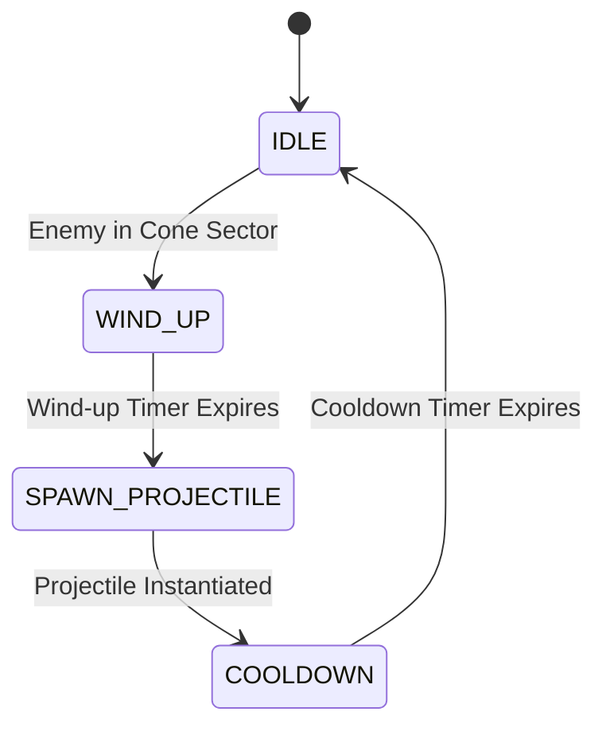

# 05 — Habit System, Directional Wedge Targeting & Projectile Mechanics

Habits are static defensive structures that scan their active cone sector, execute directional wedge targeting, and launch projectiles or area pulses. One `Habit.tscn` operates as a Focus Timer (rapid machine gun), Mindfulness pulse, or Exercise heavy launcher based on its underlying `HabitData` properties.

> Theme: Habits deal **Willpower** and/or **Awareness** damage and apply **Calm / Interrupt / Slow** status effects. They are constructed exclusively on **high ground** (`07`).

---

## 1. Cone Angle Target Filtering (Directional Wedge / SWHAOP)

Towers do NOT use default 360-degree detection unless explicitly configured for omnidirectional Support. Instead, targeting relies on a **Directional Sector Wedge**:

### Targeting Validation Criteria
An enemy target is considered **valid** if and only if:
1. **Distance Check**: `global_position.distance_to(enemy.global_position) <= attack_range`
2. **Cone Angle Vector Math**:
   ```gdscript
   var facing_vector := Vector2.RIGHT.rotated(facing_angle)
   var dir_to_enemy  := (enemy.global_position - global_position).normalized()
   var angle_diff    := absf(facing_vector.angle_to(dir_to_enemy))
   var is_in_cone    := angle_diff <= deg_to_rad(arc_angle / 2.0)
   ```

### Dynamic Arc Angle Clamping
- `arc_angle` is dynamically interpolated based on player reticle distance from tower during re-aiming:
  - **Close reticle (near 20px)**: Expands cone to wide scatter (`125.0°`).
  - **Distant reticle (near max_range)**: Tightens cone to sniper focus (`10.0°`).
- Strict Enforcement: `arc_angle = clampf(calculated_arc, 10.0, 125.0)`

```gdscript
func is_point_in_cone(target_pos: Vector2) -> bool:
	var dist := global_position.distance_to(target_pos)
	if dist > current_attack_range:
		return false
	var facing_vector := Vector2.RIGHT.rotated(facing_angle)
	var dir_to_target  := (target_pos - global_position).normalized()
	var angle_diff    := absf(facing_vector.angle_to(dir_to_target))
	return angle_diff <= deg_to_rad(arc_angle / 2.0)
```

---

## 2. Projectile Trajectory Mechanics (2.5D Visual Height)

Projectiles support two distinct trajectory modes to provide arcade-style visual feedback:

### A. Linear Homing (Fast Focus Shots / Energy Needles)
Moves directly toward the target node's live coordinates. Updates direction vector per frame.

### B. Parabolic Arc (Standard Arrows / Mortars / Artillery Bombs)
Simulates 2.5D height using a root node moving in 2D space combined with a local Y-offset applied to the child `Sprite2D`:

1. **Travel Progress**: `t = elapsed_time / total_flight_time`, clamped between `0.0` and `1.0`.
2. **Root Node**: Lerps linearly in 2D space from `start_pos` to `target_pos`:
   `global_position = start_pos.lerp(target_pos, t)`
3. **Sprite Child Visual Y-Offset**:
   `var y_offset: float = -4.0 * max_arc_height * t * (1.0 - t)`
   `sprite.position.y = y_offset`
4. **Tangent Rotation**: Rotate the sprite to match the flight vector (combining 2D ground velocity + visual height derivative `dy/dt`):
   ```gdscript
   var ground_vel   := (target_pos - start_pos) / total_flight_time
   var dy_offset_dt := -4.0 * max_arc_height * (1.0 - 2.0 * t) / total_flight_time
   var visual_vel   := ground_vel + Vector2(0, dy_offset_dt)
   sprite.rotation  := visual_vel.angle()
   ```

```gdscript
# GDScript Example: Parabolic Arc Trajectory Update
extends Node2D

@onready var sprite: Sprite2D = $Sprite2D

var start_pos: Vector2
var target_pos: Vector2
var flight_speed: float = 400.0
var max_arc_height: float = 64.0

var total_flight_time: float
var elapsed_time: float = 0.0

func setup_parabolic(from: Vector2, to: Vector2, height: float = 64.0) -> void:
	start_pos = from
	target_pos = to
	max_arc_height = height
	global_position = start_pos
	var dist := start_pos.distance_to(target_pos)
	total_flight_time = maxf(0.1, dist / flight_speed)

func _process(delta: float) -> void:
	elapsed_time += delta
	var t: float = clampf(elapsed_time / total_flight_time, 0.0, 1.0)
	
	# 2D Linear Ground Motion
	global_position = start_pos.lerp(target_pos, t)
	
	# 2.5D Visual Height Parabola
	var y_offset: float = -4.0 * max_arc_height * t * (1.0 - t)
	sprite.position.y = y_offset
	
	# Visual Tangent Rotation
	var ground_vel: Vector2 = (target_pos - start_pos) / total_flight_time
	var dy_dt: float = -4.0 * max_arc_height * (1.0 - 2.0 * t) / total_flight_time
	var visual_vel: Vector2 = Vector2(ground_vel.x, ground_vel.y + dy_dt)
	sprite.rotation = visual_vel.angle()
	
	if t >= 1.0:
		_on_impact()
```

---

## 3. Target Lead Math (Predictive Aim for Artillery)

For non-homing AoE mortar shots or heavy projectiles, towers predict the future position of moving enemies along their path:

### Predictive Flight Formula
1. **Estimated Flight Time**: `flight_time = distance_to_target / projectile_speed`
2. **Predicted Progress along Path**:
   `predicted_progress = enemy.progress + (enemy.speed * flight_time)`
3. **Sample Target Point**: Query curve or cell path at `predicted_progress` coordinate.

```gdscript
func get_predictive_target_pos(enemy: Distraction, projectile_speed: float) -> Vector2:
	var current_pos := enemy.global_position
	var dist := global_position.distance_to(current_pos)
	var est_time := dist / maxf(1.0, projectile_speed)
	
	if enemy.has_method("get_predicted_position"):
		return enemy.get_predicted_position(est_time)
	
	# Linear velocity fallback
	return current_pos + (enemy.velocity * est_time)
```

---

## 4. Attack Sequence Timing & State Machine

To enforce tactical visual feedback, towers cycle through a structured **Attack State Flow**:



### State Definitions
1. **`IDLE`**: Tower scans active cone sector (`is_point_in_cone`).
2. **`WIND_UP`**: Plays telegraph / animation (barrel recoil charging or glowing highlight).
3. **`SPAWN_PROJECTILE`**: Instantiates directional or parabolic projectile into global `ProjectileLayer`.
4. **`COOLDOWN`**: Enforces `fire_cooldown` timer before next wind-up cycle.

```gdscript
# GDScript Example: Tower Attack State Machine
enum TowerState { IDLE, WIND_UP, SPAWN_PROJECTILE, COOLDOWN }
var current_state: TowerState = TowerState.IDLE

var wind_up_time: float = 0.12
var wind_up_timer: float = 0.0

func _process_attack_state(delta: float) -> void:
	match current_state:
		TowerState.IDLE:
			if is_any_distraction_in_cone():
				current_state = TowerState.WIND_UP
				wind_up_timer = wind_up_time
		
		TowerState.WIND_UP:
			wind_up_timer -= delta
			if wind_up_timer <= 0.0:
				current_state = TowerState.SPAWN_PROJECTILE
		
		TowerState.SPAWN_PROJECTILE:
			_execute_spawn_projectile()
			current_state = TowerState.COOLDOWN
			cooldown = current_fire_cooldown
		
		TowerState.COOLDOWN:
			cooldown -= delta
			if cooldown <= 0.0:
				current_state = TowerState.IDLE
```

---

## Intersection with the prototype

**The real mechanic replaced targeting entirely — read this before tuning anything.**
`Habit` (`scripts/tower.gd`) does not select, lock, lead or even notice individual enemies.
It is a **suppression emitter**: every habit converts a fixed energy budget per second into
fire distributed across its sector, and the player's only combat control is geometry — where
the wedge points (`facing_angle`) and how wide it opens (`arc_angle`). §1's cone *filtering*
math survives (`is_point_in_cone` still gates AoE pulses, LOS and the Pomodoro's work check),
but nothing picks a target inside it any more.

- **The cone angle is the combat dial.** `ArcProfile` (`scripts/components/arc_profile.gd`)
  owns every number the width moves, all as ratios against the habit's OWN authored
  `arc_angle` (its *home* setting — at home, every multiplier is 1.0 and the .tres is the
  truth). Narrowing concentrates: damage ×`ratio^0.7` (sub-linear on purpose — halving the
  cone must not double the damage or narrow is simply correct everywhere), pierce
  ×`ratio` (bounded by `MAX_PIERCE` 8), a tighter hit window, a slightly *slower* rate, and
  **knockback** (`impulse`-scaled px of shove, budgeted per enemy — see below). Widening
  spreads: damage falls, shots die on first contact (pierce 1), rate rises ×`spread^0.25`
  (garnish, not the trade), the hit window fattens ×`spread^0.5` (what stops a fan slipping
  between two enemies it visually covered), and hits **stagger** (a shallow ≤25% slow for
  0.25s that strongest-wins Calm always beats). The ratio itself is clamped to `0.4 .. 3.0`
  so one curve behaves identically on a 45°-home habit and a 120°-home one.
- **Fire is continuous while the board is live.** No alignment gate, no aim tolerance —
  shots leave on `shot_interval()` whether or not anything stands in the wedge, so the
  stream is already in the air when a distraction walks in. The one exception: an *empty
  board* (no live distractions anywhere) holds fire — bullets at nobody cost pool slots and
  collision sweeps while telling the player something false. Shots are distributed across
  the wedge in **lanes** (`LANE_DEG` 7.5° each, visited in a strided order with sub-lane
  jitter) rather than uniform random, because random clumps — lanes are what make a wide
  cone read as a wall. Two new authored knobs on `HabitData`: `base_pierce` (pierce at home
  width — the per-weapon character stat) and `impulse` (how hard it shoves, both directions
  of the trade; 0 turns the physical response off).
- **Knockback is budgeted on the receiving end.** `Distraction.apply_knockback()` spends
  from a per-enemy budget (`KNOCK_BUDGET` 26px, refilling at 34px/s) — without it, any
  rapid-fire habit narrowed into a beam out-pushes every walking speed in the game and pins
  its target forever. A push never lands a body inside high ground (same wall dictionary as
  everything else), and it deliberately pierces `slow_immune`: being shoved is not a slow,
  and the beam is supposed to be the answer to the thing that cannot be slowed.
- **AoE habits run the same dial, different emitter.** A pulse has no lane — the cone IS the
  shot — but the width still pays on the same curve: damage scales by `damage_mult`, and the
  target cap is now `ArcProfile.aoe_targets` (6 at home, 1..12 with width) instead of a
  constant. Narrow a Mindfulness and it stops being area denial and becomes a single-target
  armour shredder. The two archetypes remain bounded mirrors: cone = area, capped
  (`aoe_targets`); projectile = line, capped (`pierce`).
- **Aiming mode is unchanged in flow, retuned in range.** Build → aim with the mouse (angle =
  facing, distance maps `20px..range → 120°..15°`) → left-click locks, right-click cancels;
  "Re-aim cone" re-enters it. New: with a habit's panel open, the **mouse wheel** opens/closes
  its cone live, ±5° per notch (`game.gd::_adjust_arc`) — mid-wave retuning is the point of
  the whole mechanic, and a modal aim step is a between-waves tool.
- **No targeting modes.** The `TargetMode` enum (Nearest/First/Strongest/Weakest) is deleted
  along with `_pick_target()` and the panel's cycling button; the panel row now shows the
  live cone readout (width, damage %, pierce/targets, interval, knockback/stagger). `02`'s
  aspirational `TargetingMode` should stay deleted.
- `projectile.gd` is directional-only — the old unreachable homing mode (`setup(target, …)`)
  has been deleted along with `Game.spawn_projectile()`. No parabolic arc height, no
  predictive lead, no `WIND_UP`/telegraph state. `pierce_max`, `hit_padding`, `knockback`
  and `stagger_factor` ride on each shot (pooled instances reset them in
  `setup_directional`), because the firing tower can be re-tuned or sold mid-flight.
- **Support habits never enter any of this.** A habit with no damage and no AoE
  (`HabitData.is_support()` — the Anchor line) skips aiming on build, never fires, and
  draws as a pylon whose ring is its Routine radius.
- Covered by `scripts/_test_suppression.gd` (`scenes/_test_suppression.tscn`): the curve's
  invariants (sub-linearity, bounds, clamp symmetry, lane containment), the emitter rules
  (holds fire on an empty board, fires with nothing in the cone, Pomodoro drains only on
  cone presence), and the knockback budget + wall check.

### What one AoE pulse does, and in what order

`Habit.apply_pulse_to(d)` is every effect a pulse lands on one distraction. It is split out
of `_process()` and public **because the order is the design and the order is invisible from
outside** — a test can call it directly instead of trying to catch a live tower mid-shot.

1. **Reframe** — strips resistance first, so the pulse's own damage gets the opening it just
   made. This is what makes Mindfulness a set-up for itself.
2. **Damage.**
3. **Slow, then Stun.** `apply_slow` is strongest-wins and a freeze (`0.0`) beats anything, so
   stunning after a partial slow costs nothing; the reverse would let the weaker slow be the
   one the player sees on a habit carrying both.
4. **Dispel** — clears Rush, leaves Overdrive alone (see below).
5. **Vulnerability** — *after* the damage, so the pulse cannot amplify itself.

Steps 1 and 5 read alike and do opposite things: Reframe is meant to pay its own caster,
Vulnerability is meant to buy damage for everyone *else*. That is the entire reason they sit
on opposite sides of the damage call.

### The three control statuses (Zen Pulsar line)

| field | effect | note |
|---|---|---|
| `stun_duration` | full freeze | routed through `apply_slow(0.0, d)` |
| `dispel_haste` | wipes Rush | leaves `extra_factor` (Overdrive) |
| `vulnerable_mult` / `_duration` | +% habit damage taken | read in `Distraction._shape_damage()` |

Three decisions worth keeping:

- **Stun is its own field, not `slow = 0.0`.** Every optional field on `HabitData` reads `0.0`
  as *off*, so a full freeze and an absent effect would be the same authored value.
- **The freeze pierces `slow_immune`.** Overdrive ignores slows by design; `StatusManager`'s
  rule is that "ignores slows" and "cannot be stopped" are different promises, and a control
  tower that did nothing to the one enemy you most want stopped would read as broken.
- **Dispel does not touch Overdrive.** That is a latched phase change a creature "does not come
  back from"; stripping it would let one habit undo a wounded Energy Drink's whole second act.

Vulnerability multiplies **on top of** the archetype shaping (`aoe_damage_mult`,
`fast_shot_damage_mult`) rather than replacing it, and deliberately does not touch Boredom —
Boredom already bypasses both resistance channels, and amplifying the one damage type nothing
mitigates compounds too hard.

### A DoT no longer forces a cone (Deep Reading)

Boredom used to be applied **only** inside the `if def.aoe:` branch, which meant "has a
damage-over-time" and "is a cone pulse" were the same fact. That coupling was invisible until
Deep Reading moved to directional page fire: flipping `aoe = false` kept the tower firing and
kept its mind damage, and silently dropped the DoT that *is* its identity. Nothing errored.

`Projectile` now carries `boredom` / `boredom_duration` per shot, with the same source
semantics as the pulse — several Deep Readings stack their own dps, one habit's own stream
only refreshes its own timer instead of ramping to infinity. Carried per-shot rather than read
off the habit because the tower can be sold mid-flight. Covered by `_test_deep_reading.gd`.

Two presentation flags came with it, both on `HabitData`:

- **`head_aims`** (default `true`) — whether the head SPRITE rotates to follow the barrel.
  Shots fly along `_aim` either way. A turret should swing to face its target; the Tome is
  drawn isometric 3/4 and GPU-rotating it through 360° spins it like a plate. Pages leaving a
  book that stays open is the readable version of the same act. AoE heads never rotated anyway,
  so this only concerns directional habits.
- **`projectile_spin`** (rad/s, default `0`) — nonzero draws the shot as a flat sheet tumbling
  end over end (a square scaled on one axis by `cos(t)`, so it foreshortens to a hairline
  edge-on) instead of the default energy bolt. `Projectile` is pooled and shared by every
  habit, so both reset on `setup_directional` like all the rest of its state.

One balance consequence worth knowing: at `fire_cooldown 0.15` Deep Reading now falls under
`clickbait`'s `fast_shot_threshold` (0.25), so its direct damage is halved against that
archetype instead of getting the 1.5× AoE bonus it used to. Its Boredom still lands at 1.5×
(`dot_damage_mult`), which turns the matchup into "the skimming doesn't hurt it, the DoT does".

### `charge_telegraph`: the sprite as the countdown

`HEAD_FPS` is a fixed 8, so head animations normally free-run on wall time. On a habit that
fires once every 4s that reads as noise. A habit with `charge_telegraph` instead maps its
**reload** onto its frames (`_advance_charge_anim()`): first frame the instant it fires, last
frame when it is ready. Both sides get to plan around the beat, which is the point of a habit
that hits hard on a timer instead of chipping continuously.

`cooldown` runs **negative** while a charged habit waits for something to enter its cone — it
is only reset on an actual shot — so the progress is clamped. Unclamped it wraps back to the
discharge frame and the tower looks like it is firing at nothing.

### The Focus Timer work cycle (Pomodoro)

The `focus_timer` line — and **only** that line — runs in work intervals. It fires for
`work_duration`, then must rest before it fires again, and the barrel returns to its facing so a
resting habit reads as visibly idle rather than merely silent. Two rules keep the rest honest:
work drains only while actually firing at a target, and **the break drains only on wave time too**
— it used to run on wall-clock, which made a break taken during the untimed build phase free (and
a rest that costs nothing teaches nothing). A habit that falls out of Routine mid-break keeps
counting its break down during waves rather than freezing there. Which break it takes is the
player's call:

| | Base | Deep Focus |
|---|---|---|
| `work_duration` | 8.0s | 11.0s |
| `break_short` (chosen via the panel button) | 3.0s | 2.5s |
| `break_long` (forced, ran to empty) | 6.0s | 5.0s |

This began as an "ammunition & reload" spec — clip size, reload timer, manual reload — applied to
every tower. It was re-scoped for two reasons worth recording:

- **Half the roster spawns no projectiles at all.** `mindfulness`, `mindfulness_2` and the
  `zen_pulsar` line are `aoe: true` pulses and `accountability` is a barracks, so "decrement ammo
  on projectile spawn" covers well under half the roster. A universal ammo attribute on a shared
  tower base was not actually universal. (`real_hobby` was on that list until it became Deep
  Reading and moved to directional page fire — see below.)
- **Focus Timer is a Pomodoro**, and a Pomodoro's defining feature *is* a mandatory break. On that
  one habit the mechanic is the thing itself rather than borrowed gun language; on Mindfulness or
  Exercise, "reloading" would be exactly the generic trope `00_overview.md` tells us to avoid.

The rejected half of the spec was the cone-angle → ammo-type synergy (wide = shrapnel, narrow =
piercing). "Armour penetration" already exists as **Reframe** (`04`), and the wide-versus-narrow
distinction is already carried by the habit roster itself — Mindfulness *is* broad coverage,
Exercise *is* narrow punch-through. It would also convert a continuous player choice (the aim step
sets any arc from 10° to 125°) into a hard threshold switch.

**The decision it creates is timing, not optimisation.** Rest during a lull and you pay 3s; keep
firing and you risk a 6s outage arriving exactly when a push does. Because the interval bar is
drawn on the habit itself, watching your focus habit is what lets you time it — which is a
pleasing thing to have to do in this particular game. Note that a player who rests at the last
possible moment gets the best uptime; that is intended, since it costs attention to achieve.

**Why this matters for the pilot:** placement is a real aiming minigame (drag to set facing +
cone width, lock it in), and combat is a geometry problem the player keeps re-solving — a narrow
beam laid down a corridor's length versus a wide wall across its mouth, retunable mid-wave with
the wheel. The suppression stream replaced the earlier nearest-in-cone target-lock: lock-on made
the cone a passive filter (the player aimed a region, the tower did the aiming that mattered) and
made the angle a range stat instead of a decision. The whiff problem that originally motivated
lock-on stays solved by the same two things that fixed it then — segment sweeps and the hit
window, which now *scales with the cone* so wide fire is fat exactly when it is blind. Predictive
lead remains deliberately unimplemented.

## Implementation checklist

- [x] Vector angle math cone filtering: `abs(facing_vector.angle_to(dir_to_enemy)) <= deg_to_rad(arc_angle / 2.0)` —
      gates AoE pulses, LOS shading and the Pomodoro work check; nothing targets inside it.
- [x] Dynamic `arc_angle` clamping between `ArcProfile.ARC_MIN` (15°) and `ARC_MAX` (120°), driven by
      reticle distance in `game.gd::_update_aiming_process()` during the aim/re-aim step, plus live
      wheel adjustment (±5°/notch) while the habit's panel is open (`_adjust_arc`).
- [x] Angle-driven stat repricing (`ArcProfile.recompute`): damage `ratio^0.7`, pierce `ratio`
      (bounded), rate `spread^0.25`, hit window `spread^0.5`, AoE cap `spread`, knockback/stagger
      by `impulse` — one clamped curve for the whole roster.
- [ ] 2.5D Parabolic arc visual height formula: `y_offset = -4.0 * max_arc_height * t * (1.0 - t)` with tangent rotation.
- [ ] Predictive lead targeting formula for non-homing artillery projectiles.
- [ ] Structured `IDLE` -> `WIND_UP` -> `SPAWN_PROJECTILE` -> `COOLDOWN` attack sequence timing state flow — the real loop is a continuous suppression stream on a single cooldown gate, no telegraph.
- [x] Work/rest cycle on the `focus_timer` line, with a player-chosen short break versus a forced
      long burnout, and the interval drawn on the habit. Deliberately **not** applied to the other
      habits — see the section above.
