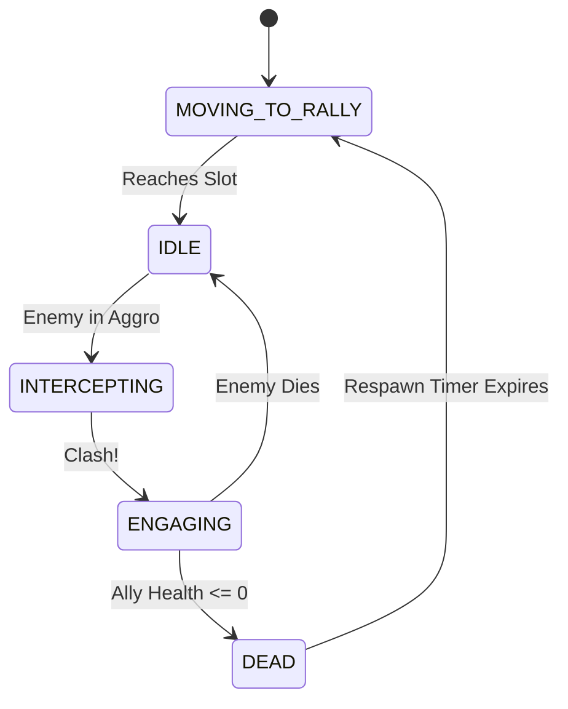

# 06 — Accountability & Allies (Blocking)

The **Accountability** habit is our "barracks": instead of shooting, it deploys a few **Allies**
(think a friend, a commitment, a support circle) that physically **block distractions** in the maze
and fight them in melee. Blocking is the one mechanic that *halts* a distraction's progress.

> Theme: Allies embody real-world support that gets *between you and the feed*. They hold a chokepoint
> in the high-ground maze (`04`/`07`) so your ranged habits (`05`) can whittle the crowd down.

We avoid physics collisions entirely: Allies use a small **tactical state machine** and set an `is_blocked`
flag on the distraction they engage (already wired in `04`), adding arcade-style collision and pushback visuals.

---

## 1. Tactical Engagement & The "Clash" Mechanic

To give melee combat a satisfying, punchy arcade feel, Allies don't just stand there; they actively intercept and "clash" with enemies.

### Interception Rules
An Ally will break formation to intercept a Distraction ONLY IF:
1. Distraction is within `aggro_radius` (default: 40px) of the Rally Point.
2. Distraction `is_blocked == false` (not already engaged).
3. Distraction is NOT a Flyer (`data.is_flying == false`).

### The Clash (Visual Pushback)
When an Ally reaches a Distraction, it applies a micro-stun and a visual knockback to sell the impact:
- **Visual Knockback**: The Distraction's sprite is briefly pushed backwards along its path by 5-10 pixels over `0.1s`.
- **Status Halt**: `is_blocked = true` completely halts the Distraction's cell-path movement.

```gdscript
func _execute_clash(distraction: Distraction) -> void:
	distraction.set_blocked(true, self)
	
	# Juicy visual knockback (tweening sprite position, NOT root node)
	var knockback_dir = (distraction.global_position - global_position).normalized()
	var original_pos = distraction.sprite.position
	var tween = create_tween().set_trans(Tween.TRANS_ELASTIC).set_ease(Tween.EASE_OUT)
	tween.tween_property(distraction.sprite, "position", original_pos + (knockback_dir * 8.0), 0.15)
	tween.tween_property(distraction.sprite, "position", original_pos, 0.1)
```

---

## 2. Dynamic Formations & Rally Points

Rally points are snapped to the `AStarGrid2D` cell centers to ensure Allies block effectively and don't clump on corners.

### Formation Positioning
Allies arrange themselves around the rally point to avoid stacking.

```gdscript
func _get_formation_slot(index: int, total_allies: int) -> Vector2:
	# Small triangle formation
	var offsets = [
		Vector2(0, 0),         # Leader/Center
		Vector2(-12, 12),      # Back Left
		Vector2(12, 12)        # Back Right
	]
	return rally_point + offsets[index % offsets.size()]
```

---

## 3. Ally State Machine & Timing

Allies cycle through a strict state machine to enforce combat timing, mirroring the tactical feel of tower attacks.



### State Definitions
1. **`MOVING_TO_RALLY`**: Lerps to assigned formation slot. Ignores enemies.
2. **`IDLE`**: Holds position. Scans `aggro_radius` for unblocked distractions.
3. **`INTERCEPTING`**: Moves rapidly toward target to initiate clash.
4. **`ENGAGING`**: Both Ally and Distraction trade blows based on `attack_cooldown`.
5. **`DEAD`**: Hides Ally, triggers respawn timer in the parent Accountability habit.

```gdscript
# GDScript Example: Ally State Processing
func _process_state(delta: float) -> void:
	match current_state:
		State.MOVING_TO_RALLY:
			if global_position.distance_to(target_slot) < 2.0:
				current_state = State.IDLE
			else:
				global_position = global_position.move_toward(target_slot, data.move_speed * delta)
				
		State.IDLE:
			var target = _find_best_target()
			if target:
				engaged_target = target
				current_state = State.INTERCEPTING
				
		State.INTERCEPTING:
			if global_position.distance_to(engaged_target.global_position) <= engage_range:
				_execute_clash(engaged_target)
				current_state = State.ENGAGING
				attack_timer = data.attack_cooldown
			else:
				global_position = global_position.move_toward(engaged_target.global_position, data.move_speed * delta)
				
		State.ENGAGING:
			if not is_instance_valid(engaged_target) or engaged_target.is_dead:
				_disengage()
				current_state = State.MOVING_TO_RALLY
			else:
				_process_melee_combat(delta)
```

---

## 4. Hierarchy — Allies are Siblings

Allies live in the shared `EntityLayer/Allies` node (`01`), **not** under the Accountability habit.
If they were children, the habit's Z-index/effects would cascade onto them and Y-sorting would break.

```text
EntityLayer (Node2D) [y_sort_enabled]
├── Habits/  └── Accountability (Node2D)
├── Distractions/
└── Allies (Node2D) [y_sort_enabled]
    ├── Ally_1 (Area2D)
    ├── Ally_2 (Area2D)
    └── Ally_3 (Area2D)
```

## Intersection with the prototype

**Rebuilt as the Nutrition Guild (16. 8. 2026) — the healthy-food defender roster.** The
`accountability` line is now the **Nutrition Guild / Fresh Pantry**: it fields a RECIPE of three
defender slots instead of training interchangeable Allies. `scripts/ally.gd` is deleted;
`scripts/defender_unit.gd` (`DefenderUnit`) is the one melee unit class for everything, and
`scripts/resources/defender_data.gd` + `data/defenders/*.tres` carry the roster:

| unit | role | the one number that defines it |
|---|---|---|
| **Broccoli Knight** | Tank | `block_capacity 3`, `damage_reduction 3` — pins crowds, shrugs counters |
| **Avocado Monk** | Support | `heal_amount 3`/s in 84px — mends every defender near it, never itself |
| **Chilli Berserker** | Striker | `attack_cooldown 0.28` + `burn_dps 3` — hits keep searing (Boredom channel, per-source) |
| **Garlic Mage** | Warden | `ward_slow_factor 0.8` in 96px — the reek slows everything shuffling through |

What matters structurally:

- **The recipe is the slot system.** Three slots, each names a DefenderData id; the panel cycles
  each slot through `Data.DEFENDER_ORDER`. Changing a slot NEVER touches the live unit — it fights
  until it dies, and the slot's next respawn (4.0s, `ally_spawn_cooldown`; Fresh Pantry 3.0s)
  brings the newly named type. The panel marks the pending swap ("next spawn"). Respawn ticks on
  WALL time deliberately: the units are free and permanent, so wave-gating the clock would only
  make you enter waves a defender short.
- **Blocking is WEIGHTED.** `DistractionData.block_weight` (1 light; doomscroll/energy_drink 2;
  the boss 3) vs `DefenderData.block_capacity` (3/2/1/1). A unit pins a target only while its
  REMAINING capacity covers the weight — otherwise it fights **on the move** (attacks, follows,
  never halts it). So the Broccoli Knight holds three pings or one boss; the Chilli harasses the
  doomscroll it cannot stop. Counters come from EVERYTHING a unit holds, not just the one it is
  striking — which is what `damage_reduction` is for, and what keeps a triple pin from being free.
- **The rally point is the guild's aim step.** Panel button → click the map; clamped to
  `guard_radius` around the tower, refused inside high ground, previewed with the same clamp the
  commit applies. The leash measures **from the rally, never from the unit** (the old anti-creep
  rule, kept). Moving the rally re-forms living units mid-wave.
- **The state machine is the design's five states, mapped honestly:** `MOVE_TO_RALLY → IDLE →
  ENGAGE → ATTACK` on the unit; `DEAD` is a freed node (death frames play on a lingering corpse
  that pins nothing); `RESPAWNING` lives in the guild's slot timer, because something has to
  outlive the body to count the 4 seconds.
- **The old balance lesson is now a dial, not a constant.** The generic Ally lost to Doomscroll by
  design ("Accountability answers swarms, not tanks"). That truth survives per-role: the Chilli
  still loses that trade — but a Broccoli Knight with reduction 3 blunts the 7-damage counters and
  actually holds. The lesson moved from "this tower cannot answer tanks" to "this tower answers
  what you STOCK it for", which is the whole point of the recipe.
- **Raw summons kept the old contract.** `DefenderUnit.setup()` has Ally.setup's exact signature;
  `call_a_friend` and card bursts spawn capacity-1, ability-less temporaries with lifetimes, same
  as ever. One class, two employers — two melee implementations would drift on the rules that
  matter (leash, prune, counters).
- **Cleanup is still double-guarded.** `_exit_tree()` releases every pin (sell/upgrade mid-fight);
  `_die()` releases them BEFORE the corpse plays its death frames; `Distraction._prune_blockers()`
  remains the second line of defence. A weighted pin that leaks is worse than the old bug — it
  also eats capacity the unit thinks it has spent, hence `_prune_pins()` every frame.
- **Upgrade carries the player's decisions.** `BuildSpot.upgrade_habit()` moves the recipe and the
  rally to the Fresh Pantry and re-fields the roster immediately at the new tier's
  `defender_hp_mult`/`defender_damage_mult` (1.3/1.25).

**Art pipeline (PixelLab, per `PIXELLAB.md` §5d):** all four defenders exist as web-created
characters; animations are template-generated (`walking-6-frames` S/N/E, `breathing-idle`,
per-role attacks — uppercut/cross-punch/lead-jab/fireball — `taking-punch`, `falling-back-death`),
downloaded 64px, halved to 32, installed as `assets/defenders/<id>_<set>_frame_N.png`. The
`DefenderUnit` loader falls back: missing west = flipped east, missing any set = the next best,
no art at all = vector body with a role glyph. Enemies gained an optional `_attack` frame set in
`distraction_animator.gd`, played while `is_blocked` — ship those per-creature whenever.

---

## Implementation checklist

- [x] Three-slot recipe with per-slot cycling, pending-swap labels, and
      respawn-as-current-slot-type (4.0s / 3.0s tier 2).
- [x] Player-set rally point: panel button, clamped placement, live preview, leash re-anchoring,
      formation re-forming mid-wave.
- [x] Weighted blocking: `block_weight` vs `block_capacity`, fight-on-the-move for overweight
      targets, counters from every pinned body, `damage_reduction` on the tank.
- [x] Heal aura (others-only), searing DoT (shared Boredom channel), pungent ward
      (strongest-wins slow floor) — each on exactly one role.
- [x] `MOVE_TO_RALLY → IDLE → ENGAGE → ATTACK` unit state machine; slot-side `RESPAWNING`;
      death frames on a lingering, non-pinning corpse.
- [x] Sprite loader: directional walk (S/N/E + flipped W), one-shot attack/hurt, idle, death;
      vector fallback per role. Enemy-side `_attack` sets wired, art to be shipped per creature.
- [x] Covered by `scripts/_test_nutrition_guild.gd` (31 checks) + the reworked barracks section
      of `_test_phase4.gd`.
- [ ] Enemy `_attack` frame sets generated for the melee-relevant creatures (loader is live,
      files not yet on disk).
