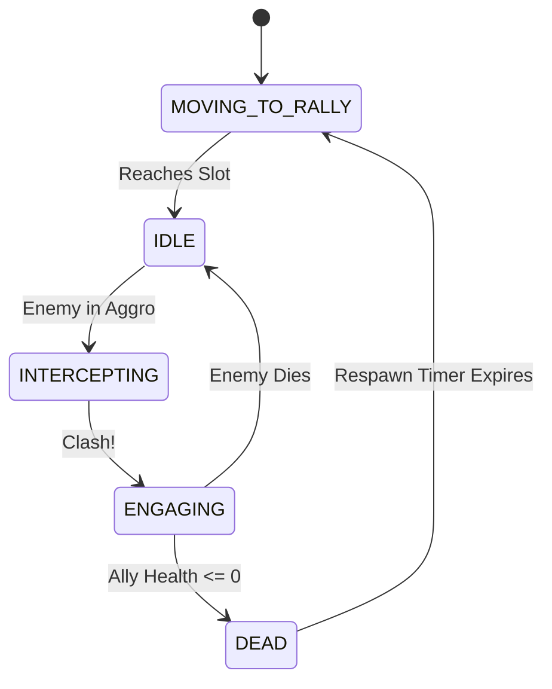

# 06 — Accountability & Allies (Blocking)

The **Accountability** habit is our "barracks": instead of shooting, it deploys a few **Allies**
(think a friend, a commitment, a support circle) that physically **block distractions** in the maze
and fight them in melee. Blocking is the one mechanic that *halts* a distraction's progress.

> Theme: Allies embody real-world support that gets *between you and the feed*. They hold a chokepoint
> in the high-ground maze (`04`/`07`) so your ranged habits (`05`) can whittle the crowd down.

We avoid physics collisions entirely: Allies use a small **tactical state machine** and set an `is_blocked`
flag on the distraction they engage (already wired in `04`), adding arcade-style collision and pushback visuals.

---

## 1. Tactical Engagement & The "Clash" Mechanic

To give melee combat a satisfying, punchy arcade feel, Allies don't just stand there; they actively intercept and "clash" with enemies.

### Interception Rules
An Ally will break formation to intercept a Distraction ONLY IF:
1. Distraction is within `aggro_radius` (default: 40px) of the Rally Point.
2. Distraction `is_blocked == false` (not already engaged).
3. Distraction is NOT a Flyer (`data.is_flying == false`).

### The Clash (Visual Pushback)
When an Ally reaches a Distraction, it applies a micro-stun and a visual knockback to sell the impact:
- **Visual Knockback**: The Distraction's sprite is briefly pushed backwards along its path by 5-10 pixels over `0.1s`.
- **Status Halt**: `is_blocked = true` completely halts the Distraction's cell-path movement.

```gdscript
func _execute_clash(distraction: Distraction) -> void:
	distraction.set_blocked(true, self)
	
	# Juicy visual knockback (tweening sprite position, NOT root node)
	var knockback_dir = (distraction.global_position - global_position).normalized()
	var original_pos = distraction.sprite.position
	var tween = create_tween().set_trans(Tween.TRANS_ELASTIC).set_ease(Tween.EASE_OUT)
	tween.tween_property(distraction.sprite, "position", original_pos + (knockback_dir * 8.0), 0.15)
	tween.tween_property(distraction.sprite, "position", original_pos, 0.1)
```

---

## 2. Dynamic Formations & Rally Points

Rally points are snapped to the `AStarGrid2D` cell centers to ensure Allies block effectively and don't clump on corners.

### Formation Positioning
Allies arrange themselves around the rally point to avoid stacking.

```gdscript
func _get_formation_slot(index: int, total_allies: int) -> Vector2:
	# Small triangle formation
	var offsets = [
		Vector2(0, 0),         # Leader/Center
		Vector2(-12, 12),      # Back Left
		Vector2(12, 12)        # Back Right
	]
	return rally_point + offsets[index % offsets.size()]
```

---

## 3. Ally State Machine & Timing

Allies cycle through a strict state machine to enforce combat timing, mirroring the tactical feel of tower attacks.



### State Definitions
1. **`MOVING_TO_RALLY`**: Lerps to assigned formation slot. Ignores enemies.
2. **`IDLE`**: Holds position. Scans `aggro_radius` for unblocked distractions.
3. **`INTERCEPTING`**: Moves rapidly toward target to initiate clash.
4. **`ENGAGING`**: Both Ally and Distraction trade blows based on `attack_cooldown`.
5. **`DEAD`**: Hides Ally, triggers respawn timer in the parent Accountability habit.

```gdscript
# GDScript Example: Ally State Processing
func _process_state(delta: float) -> void:
	match current_state:
		State.MOVING_TO_RALLY:
			if global_position.distance_to(target_slot) < 2.0:
				current_state = State.IDLE
			else:
				global_position = global_position.move_toward(target_slot, data.move_speed * delta)
				
		State.IDLE:
			var target = _find_best_target()
			if target:
				engaged_target = target
				current_state = State.INTERCEPTING
				
		State.INTERCEPTING:
			if global_position.distance_to(engaged_target.global_position) <= engage_range:
				_execute_clash(engaged_target)
				current_state = State.ENGAGING
				attack_timer = data.attack_cooldown
			else:
				global_position = global_position.move_toward(engaged_target.global_position, data.move_speed * delta)
				
		State.ENGAGING:
			if not is_instance_valid(engaged_target) or engaged_target.is_dead:
				_disengage()
				current_state = State.MOVING_TO_RALLY
			else:
				_process_melee_combat(delta)
```

---

## 4. Hierarchy — Allies are Siblings

Allies live in the shared `EntityLayer/Allies` node (`01`), **not** under the Accountability habit.
If they were children, the habit's Z-index/effects would cascade onto them and Y-sorting would break.

```text
EntityLayer (Node2D) [y_sort_enabled]
├── Habits/  └── Accountability (Node2D)
├── Distractions/
└── Allies (Node2D) [y_sort_enabled]
    ├── Ally_1 (Area2D)
    ├── Ally_2 (Area2D)
    └── Ally_3 (Area2D)
```

## Intersection with the prototype

**Built and playable — this doc's prose is now the stale half.** `scripts/ally.gd` exists,
`accountability` is in `Data.HABIT_TYPES` + `HABIT_ORDER`, `enemy.gd` carries the blocking state,
and `_build_on()` branches on `def.is_blocker` (skipping the cone-aiming step, since there is no
cone to aim). What shipped diverges from §1–§3 in five deliberate ways:

- **The barracks is a production building, not a fixed squad.** §3's model was "deploy N Allies at
  build time, each with its own respawn timer." Instead the Habit trains **one Ally every
  `ally_spawn_cooldown` (3.5s) up to `ally_count` (3) alive**, and losses are refilled on that same
  timer. There is no per-Ally `respawn_time` — a dead Ally is freed for good and the barracks
  simply trains its replacement. This reads better on screen (a visible stream of support) and
  gives the player a real reason to protect the building.
- **Allies hunt inside a guard zone, they don't wait in one.** §1's interception rule 1 had Allies
  standing still until something wandered within `aggro_radius` (40px). Instead they **actively
  intercept the nearest distraction inside `guard_radius` (240px)** and return to their slot when
  the zone is clear. The radius is measured **from the rally point, never from the Ally's own
  position** — chaining "nearest to me" would let an Ally creep across the entire map one target at
  a time, abandoning the chokepoint its barracks was built to hold, dying alone far from support,
  and halting distractions outside every habit's cone so the ranged synergy this doc's intro
  describes never happens. The zone is drawn on the barracks (faint always, bright when selected)
  and previewed while placing, since the building is otherwise impossible to position on purpose.
- **Multiple Allies gang up on one distraction.** §1's interception rule 2 (`is_blocked == false`,
  i.e. skip anything already engaged) is deliberately dropped. `Distraction.blockers` is an
  **Array**, not the single `blocker` reference this doc assumed; `add_blocker()`/`remove_blocker()`
  keep `is_blocked` true until the last Ally lets go. Without this, tanky distractions could only
  ever be fought one-on-one and would grind a lone Ally down every time.
- **Counter-damage is per distraction type.** Each row in `DISTRACTION_TYPES` carries
  `melee_damage` (notification 3, autoplay 5, doomscroll 7) instead of the flat chip-damage
  constant an early cut used — a distraction hits back as hard as its own stat block says.

  This produces a **balance result worth preserving deliberately**: an Ally's 6 Willpower is cut to
  `max(1, 6 - 4) = 2` by Doomscroll's Compulsion, while Doomscroll returns 7 **per blocking Ally**.
  Measured over a 1.2s melee window, one Ally deals 4 and takes 14 — piling onto a tank is a losing
  trade, and piling on harder loses faster. Against Notification (14 HP, no Compulsion) the same
  Ally wins comfortably. So Accountability answers swarms of small pings and *cannot* substitute for
  Exercise/Mindfulness against the deep feed, which is exactly the lesson `00` wants the mechanics
  to carry. Do not "fix" this by raising `ally_damage` — it would flatten the distinction.
- **The state machine is two states, not five.** `SEEKING <-> ENGAGING`. `MOVING_TO_RALLY`, `IDLE`,
  and `INTERCEPTING` collapse into `SEEKING` (chase a target, else drift back to the slot), and
  `DEAD` is unnecessary because death frees the node.

Two smaller notes:

- **Knockback tweens the Distraction node itself**, not `distraction.sprite` as §1's snippet shows —
  entities are `_draw()` shapes with no child sprite node. It is safe because `is_blocked` has
  already halted the cell-path movement that would otherwise fight the tween.
- **Cleanup has a single owner.** `Ally._exit_tree()` releases the melee hold *and* drops the Ally
  from `game.allies`, so every removal path is covered — lifetime expiry, death in melee, and a
  barracks sold or upgraded mid-fight. An Ally freed while engaged would otherwise leave a stale
  entry in `blockers` and pin that distraction as halted **permanently**; `Distraction._prune_blockers()`
  is a second line of defence against exactly that.

**Reused by `12`.** `call_a_friend` summons the same `Ally` class with an `ally_lifetime` (14s), so
temporary Allies expire on their own instead of holding a barracks slot; they render a draining
gold ring to show the time left. Their `guard_radius` is anchored to where they land, so the click
point is the position they hold. That ability was blocked on this doc and is now implemented.

---

## Implementation checklist

- [x] Rally Point snapping to `AStarGrid2D` cell centers — the barracks occupies a high-ground
      build spot, whose position is already a cell centre; formation slots are offsets from it.
      The rally point doubles as the anchor for `guard_radius`.
- [x] V-formation coordinate math around the rally point — triangle offsets, with `_next_free_slot()`
      handing a replacement the slot its predecessor vacated rather than stacking it on a survivor.
- [x] ~~Strict `MOVING -> IDLE -> INTERCEPTING -> ENGAGING -> DEAD` state machine~~ — superseded by
      `SEEKING <-> ENGAGING`; see the divergence note above.
- [x] "Clash" visual knockback tween on intercept — on the Distraction node, not a child sprite.
- [x] Allies parented to a Y-sorted container — landed with `01`'s `Entities` node. Not a separate
      `Allies` child container, deliberately: per-type containers cannot interleave, and an Ally
      standing below a distraction has to be able to draw in front of it.
- [x] Ensure flying Distractions ignore blockers entirely — `_find_target()` filters `is_flying`
      (no flying distraction type exists yet, so this is untested in play).
